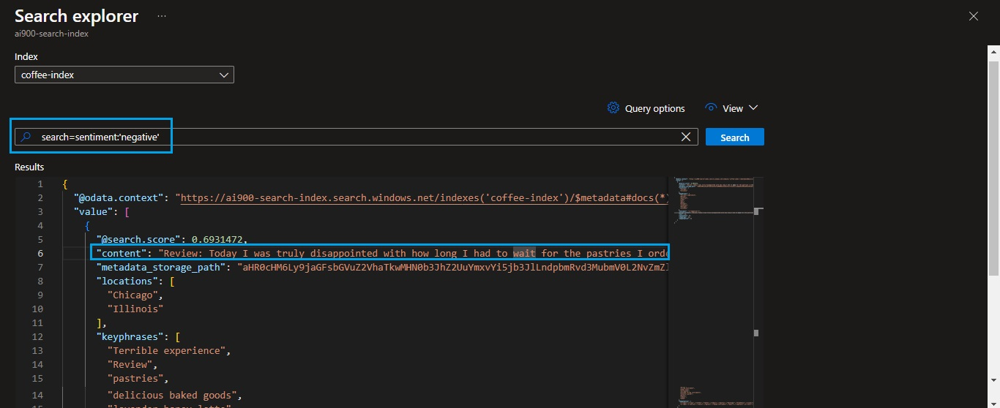

# Desafio: Utilizando AI Search para indexação e consulta de Dados


## ℹ️ Sobre:

O objetivo deste desafio é `criar um serviço de AI Search para indexação e consulta de dados`.
Utilizando aprendizado de máquina e processamento de linguagem natural, ela permite uma busca intuitiva e contextual, melhorando a experiência do usuário e acelerando a tomada de decisões. A AI Search transforma dados brutos em conhecimento acessível e acionável.


## ✅ Passos realizados:

> [!IMPORTANT]
>
> - [x] Ter um cadastro na [Azure](https://azure.microsoft.com) - realize o login na plataforma;
> - Baixe o [zipped coffee reviews](https://microsoftlearning.github.io/mslearn-ai-fundamentals/Instructions/Labs/11-ai-search.html) - Será utilizado na etapa 3 - `Storage accounts`;
> 

<br/>


> Para a realização deste desafio serão utilizados `3 recursos`. **Confira cada um abaixo**:


### 1º: `AI Search` - Serviço de Busca - (No print abaixo é possível visualizar como chegar nele)


* Clique nele e, em seguida, em `+ Create`.
* Preencha as informações conforme mostra na imagem abaixo: 


* Após preenchê-las, clique em `Review + create` e `Create`.

<br/>


### 2º: `Azure AI services` - Recuso de IA


**Na nova página, preencha as informações a seguir**:

* **Project Details**: Crie ou selecione um `Resource Group` existente;
* **Instance Details**: Region - `East US` - e Name - define um -;
* **Pricing tier**: `Standard SO`;
* [x] By checking this box I acknowledge that I have read and understood all the terms below -  `Deixe esta opção checada`
* Por fim, clique em `Review + create` e `Create`;


<br/>


### 3º: `Storage accounts` - Conta de armazenamento


**Na nova página, clicar em `+ Create` e seguir os passos abaixo**:

> Preencha:

* **Resource group**: Crie ou use um já existente;
* **Instance details** > Storage account name - defina um nome -, Region - deixe: `(US) East US` - Performance - `Standard` e Redundancy - `Locally-reduntant storage (LRS)`;
* Clique em `Review + create` e `Create`;


> ⚠️ Após criar o `Storage` selecione-o: siga os passos da imagem acima e clique no nome do storage criado.

* Realize os passos abaixo: 

1. Faça a seguinte configuração - habilite `Allow Blob anonymous access` - clique em `save` para salvar a alteração:


2. Crie um container com as informações fornecidas na imagem abaixo - não esqueça de clicar em `create`:


* Descompacte o `zipped coffee reviews` - deixei o link logo no início das instruções;

* Clique no container criado - `coffeereviews` e realize o upload das revisões;


* Na imagem abaixo é possível visualizar todas as `revisões enviadas`.


## 🎯 Testes + Resultados obtidos

* Acesse o recuros de busca criado na etapa 1 - `AI Search` e selecione o nome do recurso criado;
* Clique em `Import Data`;


Para a importação dos dados, siga as instruções presentes na documentação [Index the documents](https://microsoftlearning.github.io/mslearn-ai-fundamentals/Instructions/Labs/11-ai-search.html#index-the-documents)


* **Após importação dos dados**, clique em `Search explore` para realizar buscas por meio do mecanismo de filtragem;

1. **Na primeira pesquisa** foi aplicado o seguinte filtro: `search=locations:'Chicago'` 


<details style="border: .1rem solid #0D6EFD; padding: .5rem 1rem;">
    <summary style="font-weight: bold;">Saída 1 em JSON</summary>


```json
{
  "@odata.context": "https://ai900-search-index.search.windows.net/indexes('coffee-index')/$metadata#docs(*)",
  "value": [
    {
      "@search.score": 2.6786075,
      "content": "\nReview: I often make Fourth Coffee my meeting spot for my client meetings weekday mornings. I own a small business and the folks who work at Fourth Coffee are always very friendly. It leaves a good impression on my clients. There are also plenty of drink selections, good wi-fi, and seating. Some of my favorite coffees are the lavender honey latte and, in the winter, the apple-chai latte. There are delicious baked goods offered as well. \nDate: October 21, 2018\nLocation: Chicago, Illinois \n\nimage1.png\n\n\n\n",
      "metadata_storage_path": "aHR0cHM6Ly9jaGFsbGVuZ2VhaTkwMHN0b3JhZ2UuYmxvYi5jb3JlLndpbmRvd3MubmV0L2NvZmZlZS1yZXZpZXdzL3Jldmlldy01LmRvY3g1",
      "locations": [
        "meeting spot",
        "Chicago",
        "Illinois"
      ],
      "keyphrases": [
        "delicious baked goods",
        "lavender honey latte",
        "apple-chai latte",
        "Fourth Coffee",
        "meeting spot",
        "client meetings",
        "small business",
        "good impression",
        "drink selections",
        "good wi",
        "favorite coffees",
        "Review",
        "mornings",
        "folks",
        "clients",
        "plenty",
        "fi",
        "seating",
        "winter",
        "Date",
        "October",
        "Location",
        "Chicago",
        "Illinois"
      ],
      "sentiment": "[\"positive\"]",
      "merged_content": "\nReview: I often make Fourth Coffee my meeting spot for my client meetings weekday mornings. I own a small business and the folks who work at Fourth Coffee are always very friendly. It leaves a good impression on my clients. There are also plenty of drink selections, good wi-fi, and seating. Some of my favorite coffees are the lavender honey latte and, in the winter, the apple-chai latte. There are delicious baked goods offered as well. \nDate: October 21, 2018\nLocation: Chicago, Illinois \n\nimage1.png\n  \n\n\n",
      "text": [
        ""
      ],
      "layoutText": [
        "{\"language\":\"en\",\"text\":\"\",\"lines\":[],\"words\":[]}"
      ],
      "imageTags": [
        "clothing",
        "person",
        "furniture",
        "human face",
        "chair",
        "table",
        "woman",
        "indoor",
        "window",
        "desk",
        "sitting",
        "people",
        "restaurant"
      ],
      "imageCaption": [
        "{\"tags\":[\"person\",\"woman\",\"laptop\",\"dish\"],\"captions\":[{\"text\":\"a woman showing a woman something on a tablet\",\"confidence\":0.513512134552002}]}"
      ]
    },
    {
      "@search.score": 2.6028101,
      "content": "\n\nReview: The coffee tastings every Wednesday afternoon are so fun. Each month there is a new drink theme. You do need to book a spot in advance to attend. It is very worth it! I also love their local music. Fourth Coffee brings in rising artists every weekend. I like to head over there mid-afternoon on weekdays when it’s not too busy and get a slice of pie or their seasonal baked goods.  \nDate: August 13, 2018\nLocation: Chicago, Illinois  \n\nimage1.png\n\n\n\nimage2.png\n\n\n\n",
      "metadata_storage_path": "aHR0cHM6Ly9jaGFsbGVuZ2VhaTkwMHN0b3JhZ2UuYmxvYi5jb3JlLndpbmRvd3MubmV0L2NvZmZlZS1yZXZpZXdzL3Jldmlldy00LmRvY3g1",
      "locations": [
        "Fourth Coffee",
        "Chicago",
        "Illinois"
      ],
      "keyphrases": [
        "new drink theme",
        "seasonal baked goods",
        "coffee tastings",
        "local music",
        "Fourth Coffee",
        "rising artists",
        "ierican Coffee",
        "Review",
        "afternoon",
        "spot",
        "advance",
        "weekdays",
        "slice",
        "pie",
        "Date",
        "August",
        "Location",
        "Chicago",
        "Illinois"
      ],
      "sentiment": "[\"positive\"]",
      "merged_content": "\n\nReview: The coffee tastings every Wednesday afternoon are so fun. Each month there is a new drink theme. You do need to book a spot in advance to attend. It is very worth it! I also love their local music. Fourth Coffee brings in rising artists every weekend. I like to head over there mid-afternoon on weekdays when it’s not too busy and get a slice of pie or their seasonal baked goods.  \nDate: August 13, 2018\nLocation: Chicago, Illinois  \n\nimage1.png\n ierican Coffee 114 10148/0034 \n\n\nimage2.png\n  \n\n\n",
      "text": [
        "ierican Coffee 114 10148/0034",
        ""
      ],
      "layoutText": [
        "{\"language\":\"en\",\"text\":\"ierican Coffee 114 10148/0034\",\"lines\":[{\"boundingBox\":[{\"x\":701,\"y\":284},{\"x\":649,\"y\":303},{\"x\":647,\"y\":297},{\"x\":699,\"y\":279}],\"text\":\"ierican Coffee\"},{\"boundingBox\":[{\"x\":682,\"y\":241},{\"x\":614,\"y\":263},{\"x\":611,\"y\":251},{\"x\":678,\"y\":228}],\"text\":\"114 10148/0034\"}],\"words\":[{\"boundingBox\":[{\"x\":701,\"y\":285},{\"x\":679,\"y\":293},{\"x\":676,\"y\":287},{\"x\":699,\"y\":279}],\"text\":\"ierican\"},{\"boundingBox\":[{\"x\":676,\"y\":294},{\"x\":652,\"y\":303},{\"x\":650,\"y\":297},{\"x\":674,\"y\":288}],\"text\":\"Coffee\"},{\"boundingBox\":[{\"x\":682,\"y\":242},{\"x\":672,\"y\":245},{\"x\":668,\"y\":232},{\"x\":678,\"y\":229}],\"text\":\"114\"},{\"boundingBox\":[{\"x\":669,\"y\":245},{\"x\":618,\"y\":262},{\"x\":615,\"y\":251},{\"x\":666,\"y\":233}],\"text\":\"10148/0034\"}]}",
        "{\"language\":\"en\",\"text\":\"\",\"lines\":[],\"words\":[]}"
      ],
      "imageTags": [
        "food",
        "chocolate",
        "table",
        "cup",
        "serveware",
        "indoor",
        "cocoa solids",
        "caffeine",
        "tableware",
        "sitting",
        "coffee",
        "dessert",
        "musical instrument",
        "music",
        "concert",
        "clothing",
        "person",
        "string instrument",
        "human face",
        "microphone",
        "plucked string instruments",
        "acoustic guitar",
        "guitar",
        "indoor",
        "woman"
      ],
      "imageCaption": [
        "{\"tags\":[\"cup\",\"coffee\",\"table\",\"indoor\",\"pastry\",\"beverage\",\"breakfast\",\"close\"],\"captions\":[{\"text\":\"a group of small cups with brown liquid in them\",\"confidence\":0.39556038379669189}]}",
        "{\"tags\":[\"person\",\"music\",\"guitar\",\"bowed instrument\",\"bass\"],\"captions\":[{\"text\":\"a person playing a guitar\",\"confidence\":0.54444891214370728}]}"
      ]
    },
    {
      "@search.score": 2.346014,
      "content": "Review: Today I was truly disappointed with how long I had to wait for the pastries I ordered ahead of time. When I got my box, some of the pastries seemed stale. Terrible experience!  \nDate: October 23, 2018\nLocation: Chicago, Illinois \n\n",
      "metadata_storage_path": "aHR0cHM6Ly9jaGFsbGVuZ2VhaTkwMHN0b3JhZ2UuYmxvYi5jb3JlLndpbmRvd3MubmV0L2NvZmZlZS1yZXZpZXdzL3Jldmlldy04LmRvY3g1",
      "locations": [
        "Chicago",
        "Illinois"
      ],
      "keyphrases": [
        "Terrible experience",
        "Review",
        "pastries",
        "time",
        "box",
        "Date",
        "October",
        "Location",
        "Chicago",
        "Illinois"
      ],
      "sentiment": "[\"negative\"]",
      "merged_content": "Review: Today I was truly disappointed with how long I had to wait for the pastries I ordered ahead of time. When I got my box, some of the pastries seemed stale. Terrible experience!  \nDate: October 23, 2018\nLocation: Chicago, Illinois \n\n",
      "text": [],
      "layoutText": [],
      "imageTags": [],
      "imageCaption": []
    }
  ]
}
```
</details>


<br/>

2. **Na segunda pesquisa** foi aplicado o seguinte filtro: `search=sentiment:'negative'`




<details style="border: .1rem solid #0D6EFD; padding: .5rem 1rem;">
    <summary style="font-weight: bold;">Saída 2 em JSON</summary>

```json
{
  "@odata.context": "https://ai900-search-index.search.windows.net/indexes('coffee-index')/$metadata#docs(*)",
  "value": [
    {
      "@search.score": 0.6931472,
      "content": "Review: Today I was truly disappointed with how long I had to wait for the pastries I ordered ahead of time. When I got my box, some of the pastries seemed stale. Terrible experience!  \nDate: October 23, 2018\nLocation: Chicago, Illinois \n\n",
      "metadata_storage_path": "aHR0cHM6Ly9jaGFsbGVuZ2VhaTkwMHN0b3JhZ2UuYmxvYi5jb3JlLndpbmRvd3MubmV0L2NvZmZlZS1yZXZpZXdzL3Jldmlldy04LmRvY3g1",
      "locations": [
        "Chicago",
        "Illinois"
      ],
      "keyphrases": [
        "Terrible experience",
        "Review",
        "pastries",
        "time",
        "box",
        "Date",
        "October",
        "Location",
        "Chicago",
        "Illinois"
      ],
      "sentiment": "[\"negative\"]",
      "merged_content": "Review: Today I was truly disappointed with how long I had to wait for the pastries I ordered ahead of time. When I got my box, some of the pastries seemed stale. Terrible experience!  \nDate: October 23, 2018\nLocation: Chicago, Illinois \n\n",
      "text": [],
      "layoutText": [],
      "imageTags": [],
      "imageCaption": []
    }
  ]
}
```
</details>


<br/>

## Conclusão

A busca por IA para indexação e consulta de dados revoluciona a maneira como interagimos com grandes volumes de informação. Ferramentas como assistentes virtuais, sistemas de recomendação e plataformas de análise de dados se beneficiam enormemente, oferecendo respostas rápidas e insights precisos. Durante o processo, aprende-se a importância da qualidade dos dados, a necessidade de algoritmos eficientes e a capacidade de adaptar-se continuamente às mudanças nas tendências de dados. A IA não apenas simplifica a busca por informações, mas também desbloqueia novas possibilidades para descobertas e inovações.


## 📖 Referência:

* [Explore an Azure AI Search index (UI)](https://aka.ms/ai900-ai-search)
